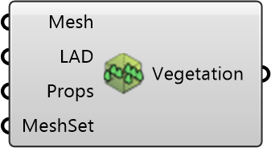

##  Vegetation Region

Create a vegetation region with properties and mesh settings.
 Eddy3D 1.0.0.827

#### Input
* ##### Mesh 
Vegetation meshes for the region.
* ##### LAD 
Leaf area density for vegetation.
* ##### Props 
Optional vegetation property settings.
* ##### MeshSet 
Optional meshing settings for vegetation.

#### Output
* ##### Vegetation
Vegetation region object for the case.