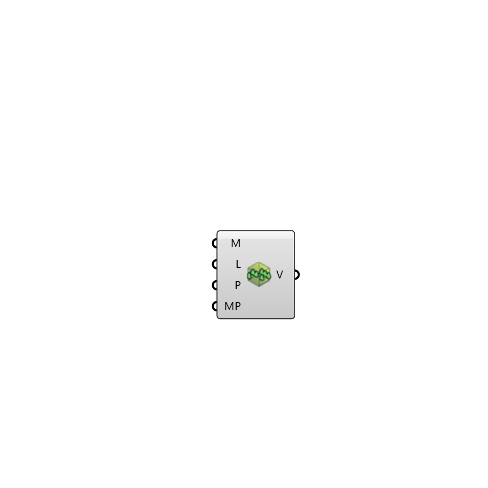

##  Vegetation Region - [[source code]](https://github.com/Eddy3D-Dev/Eddy3D-UMCF/blob/release/UMCF/CMP/Vegetation/VegetationRegionCMP.cs)

Description

#### Input
* ##### M
Vegetation mesh
* ##### L
Leaf Area Density of the vegetation
* ##### P
Vegetation properties
* ##### MP
Mesh parameteres

#### Output
* ##### V
Vegetation region.