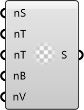

##  ViewFactors

Configure the view-factor discretization for radiation modeling.
 OutdoorPlus 0.0.20.0

#### Input
* ##### SideFaces 
Number of faces in the coarsest level for domain side walls.
* ##### TopFaces 
Number of faces in the coarsest level for the domain top.
* ##### TerrainFaces 
Number of faces in the coarsest level for terrain.
* ##### BuildingFaces 
Number of faces in the coarsest level for buildings.
* ##### VegFaces 
Number of faces in the coarsest level for vegetation.

#### Output
* ##### ViewFactors
View-factor settings.