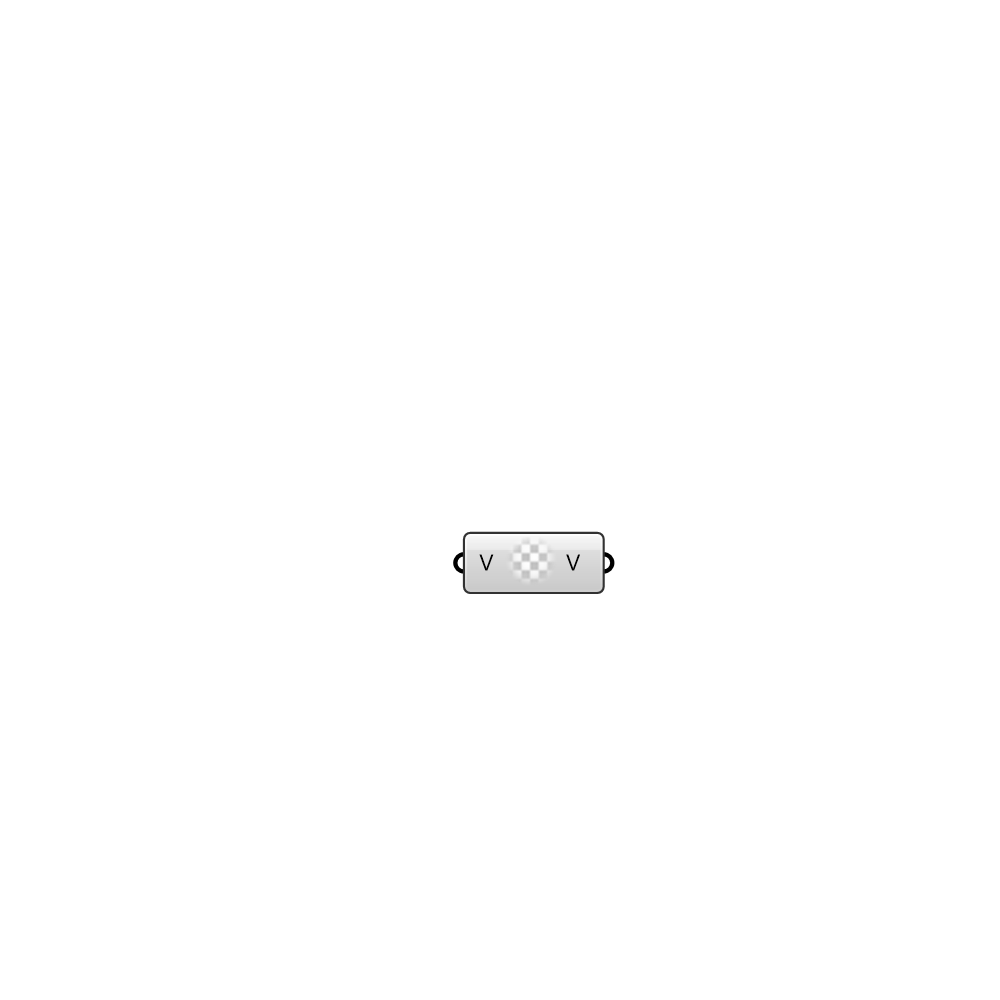

##  uniform vector - [[source code]](https://github.com/Eddy3D-Dev/Eddy3D-UMCF/blob/release/UMCF/CMP/Meta/uniformvectorCMP.cs)

uniform vector value

#### Input
* ##### V
Vector

#### Output
* ##### V
The created uniform vector value instance