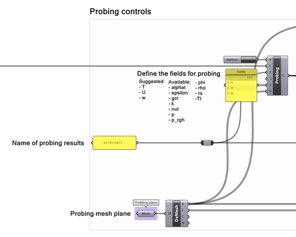

# Eddy3D - Comfort+

**A collection of components to use the urbanMicroclimateFoam solver**

UMCF (`urbanMicroclimateFoam`) is an open-source solver for coupled physical processes modeling urban microclimate based on `OpenFOAM`. 
This computational fluid dynamics model solves turbulent, convective airflow, and handles heat and moisture transport in the air subdomain. 
It also uses the HAM (Heat Moisture Transport Model) that manages absorption and transport. The HAM model controls the storage of heat and 
moisture in porous building materials. A Radiation model calculates net longwave and shortwave radiative heat fluxes, using the view factor 
approach. Finally, a Vegetation model solves the heat balance for urban trees and handles green surfaces.

- Find more information in the ETH Zürich GitHub repository: <https://github.com/OpenFOAM-BuildingPhysics/urbanMicroclimateFoam>

---

#### Prerequisites

##### blueCFD-Core 2020

Download `blueCFD-Core-2020-1-win64-setup.exe` from [bluecfd.github.io](https://bluecfd.github.io/Core/Downloads/#bluecfd-core-2020-1). This provides `OpenFOAM 8`.

##### UMCF plugin from Rhinoceros PackageManager

In Rhinoceros, execute the PackageManager command and search for "UMCF". It is recommended to check the "Include pre-releases" box to view all versions. Click Install, and restart Rhinoceros to complete the installation.

#### Verify Installation

Find the **`Check Installation`** component:

If the Check input is set to True, the component will verify the installation files. Since this is a clean installation, you need to **set the Install UrbanMicroclimateFoam input to True.** The console interface will appear to install all the necessary files.

---

#### Work with premade template

Find the **`Templates`** component. It contains the complete initial definition to perform the meshing-simulation-visualization process. Right click on the **`Templates`** component and select the `UMCF.Templates.MicroclimateSimulation.gh` option.

The following solution will appear:

First, you need to provide the path to an **EPW file** as input for the **`Weather`** component, which is required to set up the **`Timing`** component.

The template simulation setup consists of five solid mesh geometries representing buildings, and eight mesh geometries representing trees for the Vegetation region.  **Before writing the case, you need to define the settings for all three regions.**

The **Air Region** component requires the boundary layer condition and the definition of the box simulation domain. The **`Atmospheric Boundary Layer`** condition (ABL) defines the Wind Speed and Height values, as well as the Wind Direction vector. In this template, the vector definition can be controlled by rotating the X-axis vector. The **`Box Domain Dimensions`** (`BoxDomainDim`) consist of the following parameters:

-   **Cell Size:** the initial size of the cell, determining the overall resolution of the simulation results.

-   **Front Add:** the distance between the front face of the geometry bounding box and the simulation domain box. If set to 0, the distance will be set to 15 times the height of the geometry bounding box.

-   **Back Add:** the distance between the back face of the geometry bounding box and the simulation domain box. If set to 0, the distance will be set to 5 times the height of the geometry bounding box.

-   **Sides Add:** the distance between the side faces of the geometry bounding box and the simulation domain box. If set to 0, the distance will be set to 5 times the height of the geometry bounding box.

-   **Top Add:** the distance between the top face of the geometry bounding box and the simulation domain box. If set to 0, the distance will be set to 6 times the height of the geometry bounding box.

-   **Refinement Box Add:** the offset distance from the geometry bounding box. 

The **Solid Region** for buildings component has four inputs: mesh of the buildings, material of the buildings, building mesh parameters, and building temperature. The building temperature is for the inside of the building in Celsius degrees. The temperature remains constant for the entire simulation time. For this version, the building material is defined by the **`Building Material Hamstad5Brick`** model. Also, the **`Solid Mesh Parameters`** (`SolidMeshParas`) allow the user to define the refinement level of the building geometry for the meshing process. With no input provided, it will use the standard values defined in the `snappyHexMeshDict`. The definition requires inputting any mesh geometry that is intended to serve as buildings.

The **Vegetation Region** follows a similar structure, requiring the following inputs: vegetation mesh, Leaf Area Density (LAD) value of the vegetation, vegetation properties, and mesh parameters. Vegetation properties are defined in the constant/air/vegetationProperties file. The values by default are defined as follows:

Also, the **`Vegetation Mesh Settings`** (`VegMeshSettings`) allow the user to define the refinement level of the vegetation geometry for the meshing process. With no input provided, it will use the standard values defined in the snappyHexMeshDict. The definition requires inputting any mesh geometry that is intended to serve as vegetation elements.

Before writing the case, the simulation settings need to be defined. For standard usage, it is recommended to define the **Number of CPUs** and `maxFluidIteration`. A recommended stable value for the number of CPUs is 10. The value for `maxFluidIteration` will determine the overall resolution in the simulation results.

The outputs of the **`UMCF Case`** component are Case modification logs, Modified case, Domain Box, and Refinement Box. The template provides a quick visualization setup to render the edges of both box elements. After the UMCF Case is created successfully, two final steps need to be executed: **Prepare simulation** and **Run simulation**. The first step will generate the mesh geometries that the solver needs to then execute the simulation. It is *highly recommended* that the same type of execution is chosen either prepare and run in single processor or prepare and run in parallel.

The simulation preparation (meshing) (1) will execute a series of `OpenFOAM` functions to generate the appropriate mesh geometry. After the meshing process finishes successfully, the case is ready to perform the simulation process (2).

After the simulation process finishes, a series of new folders and files will appear in the directory containing the `UMCF case`. At this point, the `UMCFfoam.foam` file can be used to visualize the mesh geometries and simulation results in Paraview.

The 0 folder generated after writing the UMCF case is the initial condition of the simulation domain. After the simulation process finishes, a series of additional folders are generated based on the controlDict settings (or simulation settings). This result is the outcome of the definition of startTime 0, endTime 43200, and deltaT 3600. **This means that the simulation results start at time 0, and advanced in hourly steps. The total simulated time is 43200 seconds, which is 12 hours.**

The probing section of the template allows to generate a Rhinoceros-Grasshopper visualization based on the simulation results. The general fields defined to probe results are `Temperature (T)`, `Velocity (U)`, and `Humidity (w)`. For this step, a probing plane is required. The mesh plane consists of a quad face mesh at a specified height (defined by the user) with all faces except the ones that are inside of the building geometry. The resolution of this mesh plane will determine the total amount of probing points. By clicking on the **`Run`** button, the OpenFOAM probing function will be executed.

After the probing is completed, the **`Probing`** component needs to be re-enabled to load the results. This will load the results for each of the **`GetProbes`** components, allowing the user to visualize the values mapped on the probing mesh plane initially provided. The Hour slider allows the user to navigate through the resulting timesteps.

---

#### Results visualization

Velocity (U), Temperature (T), and Humidity (w) are the set of results generated by the template.

