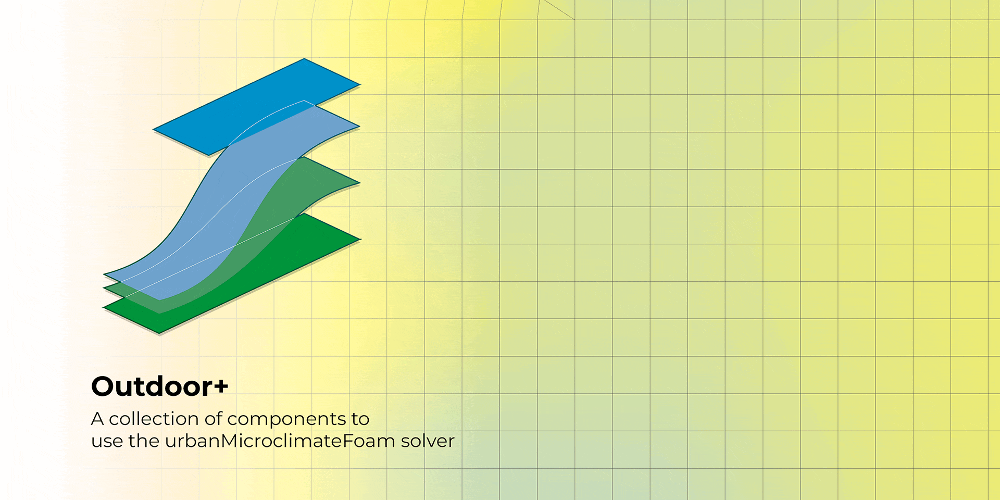

# Eddy3D &mdash; Outdoor+

!!! warning "Alpha Version"
    This module is currently in alpha testing. Features, inputs, and outputs are subject to change without notice.

### A Grasshopper plugin for microclimate simulations

___

**UMCF** (`urbanMicroclimateFoam`) is an open-source solver for coupled physical processes modeling urban microclimate based on `OpenFOAM`.

### Key Features
 🌊 **CFD** - Solves turbulent, convective airflow
- Handles heat and moisture transport in the `air` subdomain

 🏗️ **HAM** - Manages absorption and transport
- Controls storage of heat and moisture in porous building materials

☀️ **RAD** - Calculates net longwave and shortwave radiative heat fluxes
- Uses view factor approach

🌳 **VEG** - Solves heat balance for urban trees
- Handles green surfaces

### Acknowledgments

The plugin is based on the `urbanMicroclimateFoam` (UMF) open-source solver based on OpenFOAM, developed by the [Chair of Building Physics at ETH Zürich](https://carmeliet.ethz.ch/) the Canada Research Chair Tier I in Multiscale Building Physics at Université de Sherbrooke, Canada. 

- [urbanMicroclimateFoam GitHub repository](https://github.com/OpenFOAM-BuildingPhysics/urbanMicroclimateFoam)
- [urbanMicroclimateFoam GitLab repository](https://gitlab.ethz.ch/openfoam-cbp/solvers/urbanmicroclimatefoam)

This project is partially funded by [Perkins&Will Research](https://perkinswill.com/research/). Their support has been instrumental in advancing this tool.

___

This project originated from the VIP - Surrogate Models for Urban Regeneration during Fall 2024. Visit the [VIP - Surrogate Models for Urban Regeneration documentation](https://vip-smur.github.io/24fa-microclimate-umcf/) for more details and view the final presentation.
